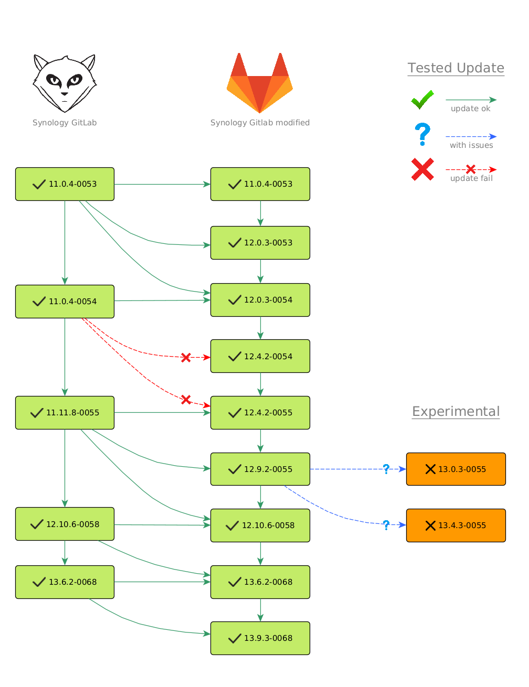

## synology-gitlab

This is an upgraded and improved GitLab package which uses the stock Synology Package from [Synology Repo](https://www.synology.com/de-de/dsm/packages/Docker-GitLab) and can be installed over the original package.

**Download Gitlab 12.9.2-0055 SPK**: [here](https://github.com/jboxberger/synology-gitlab/releases)

## Hardware Requirements:
- 1 CPU core ( 2 cores is recommended )
- 2 GB RAM ( 4GB RAM is recommended )

Looking for a more lightweight GIT Package with a GitLab like UI, then check my new [Gitea Synology Package](https://github.com/jboxberger/synology-gitea-jboxberger). Gitea requires only 80MB RAM and have all basic features onboard (Web UI, Git, Issues, Wiki and more).

## Additional Features
- All-In-One Installer
- restore custom ENVIRONMENT variables after update (any variable not in scripts/env_ignore)

## Supported Architectures
**x86_64** your architectures is not supported? Just let me know and we can give it a try.
You can check the architecture of your device [here](https://github.com/SynoCommunity/spksrc/wiki/Architecture-per-Synology-model)
or [here](https://www.synology.com/en-us/knowledgebase/DSM/tutorial/General/What_kind_of_CPU_does_my_NAS_have).

# Updates
**Always backup data before update! _Please be patient during the Update process_**.
The first docker container boot up - after installation/update - takes some minutes because GitLab needs to migrate the
Database first, you can see the status in the GitLab container log (DSM docker backend). __**The Update is complete when the CPU begins to idle.**__



# Backup
**Warning:**
GitLab does not back up any configuration files, SSL certificates, or system files. You are highly advised to [read about storing configuration files](https://docs.gitlab.com/ee/raketasks/backup_restore.html#storing-configuration-files).

```bash
# backup files will be saved in gitlab/backups directory usually ( /volume1/docker/gitlab/gitlab/backups )
# the backup contains the config files including !PASSWORDS! be shure to keep them in an safe place!
#
# Parameters:
# RAILS_ENV => we have only "production" environment so this parameter is pretty static
# CRON=1 => Parameter supress any output. To get detailed debug information remove the parameter from command ( CRON=0 will not work )

sudo /usr/local/bin/docker exec -it synology_gitlab bash -c "sudo -u git -H bundle exec rake gitlab:backup:create RAILS_ENV=production CRON=1"

# you can make the backups readable by your DSM user but use this only when you know what you're doing and do not have any
# security concerns
sudo chmod g+rw /volume1/docker/gitlab/backups/*.tar
```

# Restore
```bash
# restoring only works within a version. restoring a backup from version 10.1.2 to 10.1.1 or from 10.1.1 to 10.1.2 will NOT work
# only restoring from 10.1.2 to 10.1.2 will work.
#
# Parameters:
# RAILS_ENV => we have only "production" environment so this parameter is pretty static
# BACKUP => backup name (NOT filename) file: 1544961414_2018_12_16_9.4.4_gitlab_backup.tar => backup_name: 1544961414_2018_12_16_9.4.4

sudo /usr/local/bin/docker exec -it synology_gitlab bash -c "sudo -u git -H bundle exec rake gitlab:backup:restore RAILS_ENV=production BACKUP=1544961414_2018_12_16_9.4.4"
```

# Build instructions
```
################################################################################################################
# Make shure docker is already installed and runnig
# All in One Package: The docker image is in the .spk. This leads to a much bigger .spk file but on the other
#                     hand you avoid all possible issues during docker pull and this package could be installed
#                     offline. Harder to build but gives a more stable update process.
# On Demand Package : (not recommended) Docker image is not in the .spk file and will be pulled during spk
#                     installation. The benefit here is a smaller package size and easy to build .spk - May
#                     cause problems during installation when the docker image pull is not working properly or
#                     connection breaks down. This may cause a half installed Package which should be cleaned
#                     up and backup properly to be able to re-install.
################################################################################################################

# All in One Package
----------------------------------------------------------------------------------------------------------------
# 1) bash build.sh
#   - follow instructions

# On Demand Package (docker image will be pulled during spk installation)
----------------------------------------------------------------------------------------------------------------
# 1) bash build.sh --docker-no-autopull
#   - when aked for export, reply with "n"

# you will find the new .spk in the folder build/<version>/
```
